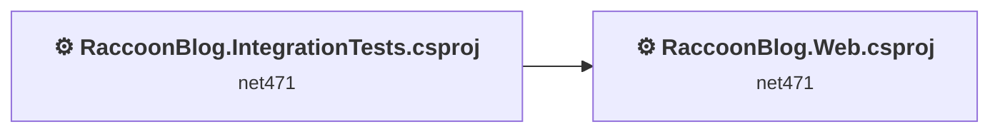
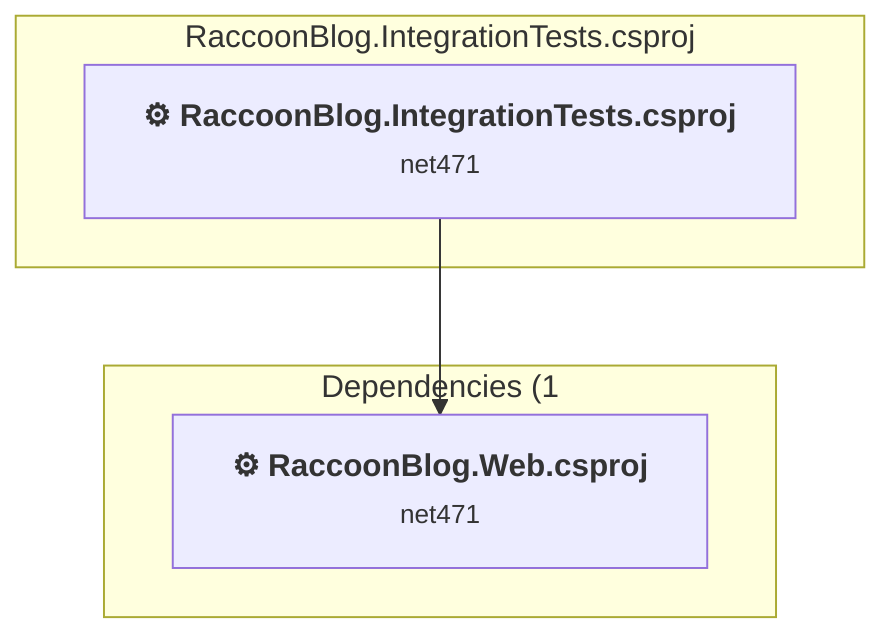
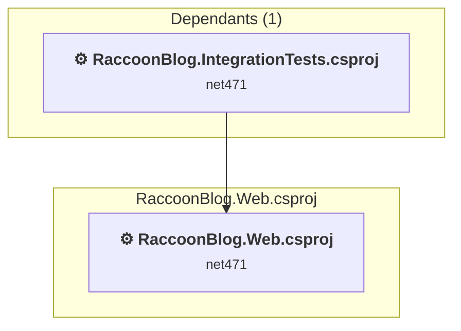

# Projects and dependencies analysis

This document provides a comprehensive overview of the projects and their dependencies in the context of upgrading to .NETCoreApp,Version=v8.0.

## Table of Contents

- [Executive Summary](#executive-Summary)
  - [Highlevel Metrics](#highlevel-metrics)
  - [Projects Compatibility](#projects-compatibility)
  - [Package Compatibility](#package-compatibility)
  - [API Compatibility](#api-compatibility)
- [Aggregate NuGet packages details](#aggregate-nuget-packages-details)
- [Top API Migration Challenges](#top-api-migration-challenges)
  - [Technologies and Features](#technologies-and-features)
  - [Most Frequent API Issues](#most-frequent-api-issues)
- [Projects Relationship Graph](#projects-relationship-graph)
- [Project Details](#project-details)

  - [RaccoonBlog.IntegrationTests\RaccoonBlog.IntegrationTests.csproj](#raccoonblogintegrationtestsraccoonblogintegrationtestscsproj)
  - [RaccoonBlog.Web\RaccoonBlog.Web.csproj](#raccoonblogwebraccoonblogwebcsproj)

## Executive Summary

### Highlevel Metrics

| Metric | Count | Status |
| :--- | :---: | :--- |
| Total Projects | 2 | All require upgrade |
| Total NuGet Packages | 83 | 42 need upgrade |
| Total Code Files | 257 |  |
| Total Code Files with Incidents | 105 |  |
| Total Lines of Code | 20238 |  |
| Total Number of Issues | 2674 |  |
| Estimated LOC to modify | 2597+ | at least 12.8% of codebase |

### Projects Compatibility

| Project | Target Framework | Difficulty | Package Issues | API Issues | Est. LOC Impact | Description |
| :--- | :---: | :---: | :---: | :---: | :---: | :--- |
| [RaccoonBlog.IntegrationTests\RaccoonBlog.IntegrationTests.csproj](#raccoonblogintegrationtestsraccoonblogintegrationtestscsproj) | net471 | 🟡 Medium | 5 | 180 | 180+ | ClassicClassLibrary, Sdk Style = False |
| [RaccoonBlog.Web\RaccoonBlog.Web.csproj](#raccoonblogwebraccoonblogwebcsproj) | net471 | 🔴 High | 57 | 2417 | 2417+ | Wap, Sdk Style = False |

### Package Compatibility

| Status | Count | Percentage |
| :--- | :---: | :---: |
| ✅ Compatible | 41 | 49.4% |
| ⚠️ Incompatible | 34 | 41.0% |
| 🔄 Upgrade Recommended | 8 | 9.6% |
| ***Total NuGet Packages*** | ***83*** | ***100%*** |

### API Compatibility

| Category | Count | Impact |
| :--- | :---: | :--- |
| 🔴 Binary Incompatible | 2267 | High - Require code changes |
| 🟡 Source Incompatible | 330 | Medium - Needs re-compilation and potential conflicting API error fixing |
| 🔵 Behavioral change | 0 | Low - Behavioral changes that may require testing at runtime |
| ✅ Compatible | 12429 |  |
| ***Total APIs Analyzed*** | ***15026*** |  |

## Aggregate NuGet packages details

| Package | Current Version | Suggested Version | Projects | Description |
| :--- | :---: | :---: | :--- | :--- |
| Antlr | 3.5.0.2 |  | [RaccoonBlog.Web.csproj](#raccoonblogwebraccoonblogwebcsproj) | Needs to be replaced with Replace with new package Antlr4=4.6.6 |
| AttributeRouting | 3.5.6 |  | [RaccoonBlog.Web.csproj](#raccoonblogwebraccoonblogwebcsproj) | ⚠️NuGet package is incompatible |
| AttributeRouting.Core | 3.5.6 |  | [RaccoonBlog.Web.csproj](#raccoonblogwebraccoonblogwebcsproj) | ⚠️NuGet package is incompatible |
| AttributeRouting.Core.Web | 3.5.6 |  | [RaccoonBlog.Web.csproj](#raccoonblogwebraccoonblogwebcsproj) | ⚠️NuGet package is incompatible |
| AutoMapper | 6.2.2 |  | [RaccoonBlog.IntegrationTests.csproj](#raccoonblogintegrationtestsraccoonblogintegrationtestscsproj) [RaccoonBlog.Web.csproj](#raccoonblogwebraccoonblogwebcsproj) | ✅Compatible |
| bootstrap | 3.3.1 | 5.3.8 | [RaccoonBlog.Web.csproj](#raccoonblogwebraccoonblogwebcsproj) | NuGet package contains security vulnerability |
| DataAnnotationsExtensions | 5.0.1.20 |  | [RaccoonBlog.Web.csproj](#raccoonblogwebraccoonblogwebcsproj) | ⚠️NuGet package is incompatible |
| DataAnnotationsExtensions.MVC3 | 5.0.1.20 |  | [RaccoonBlog.Web.csproj](#raccoonblogwebraccoonblogwebcsproj) | ⚠️NuGet package is incompatible |
| dotless | 1.5.2 |  | [RaccoonBlog.Web.csproj](#raccoonblogwebraccoonblogwebcsproj) | ✅Compatible |
| DotNetOpenAuth.Core | 4.3.4.13329 |  | [RaccoonBlog.Web.csproj](#raccoonblogwebraccoonblogwebcsproj) | ⚠️NuGet package is incompatible |
| DotNetOpenAuth.Mvc5 | 4.3.4.13329 |  | [RaccoonBlog.Web.csproj](#raccoonblogwebraccoonblogwebcsproj) | ⚠️NuGet package is incompatible |
| FluentScheduler | 5.3.0 |  | [RaccoonBlog.Web.csproj](#raccoonblogwebraccoonblogwebcsproj) | ✅Compatible |
| HtmlAgilityPack | 1.6.16 |  | [RaccoonBlog.IntegrationTests.csproj](#raccoonblogintegrationtestsraccoonblogintegrationtestscsproj) [RaccoonBlog.Web.csproj](#raccoonblogwebraccoonblogwebcsproj) | ✅Compatible |
| JetBrains.Annotations | 11.1.0 |  | [RaccoonBlog.Web.csproj](#raccoonblogwebraccoonblogwebcsproj) | ✅Compatible |
| jQuery | 1.11.2 | 3.7.1 | [RaccoonBlog.Web.csproj](#raccoonblogwebraccoonblogwebcsproj) | NuGet package contains security vulnerability |
| jQuery.Migrate | 1.2.1 |  | [RaccoonBlog.Web.csproj](#raccoonblogwebraccoonblogwebcsproj) | ✅Compatible |
| jQuery.Templates | 0.1 |  | [RaccoonBlog.Web.csproj](#raccoonblogwebraccoonblogwebcsproj) | ✅Compatible |
| jQuery.UI.Combined | 1.11.2 | 1.14.1 | [RaccoonBlog.Web.csproj](#raccoonblogwebraccoonblogwebcsproj) | NuGet package contains security vulnerability |
| jQuery.Validation | 1.13.1 | 1.21.0 | [RaccoonBlog.Web.csproj](#raccoonblogwebraccoonblogwebcsproj) | NuGet package contains security vulnerability |
| Lambda2Js.Signed | 3.1.4 |  | [RaccoonBlog.Web.csproj](#raccoonblogwebraccoonblogwebcsproj) | ✅Compatible |
| MarkdownDeep.Full | 1.5 |  | [RaccoonBlog.Web.csproj](#raccoonblogwebraccoonblogwebcsproj) | ✅Compatible |
| Microsoft.AspNet.Identity.Core | 2.2.4 |  | [RaccoonBlog.Web.csproj](#raccoonblogwebraccoonblogwebcsproj) | ⚠️NuGet package is incompatible |
| Microsoft.AspNet.Identity.Owin | 2.2.4 |  | [RaccoonBlog.Web.csproj](#raccoonblogwebraccoonblogwebcsproj) | ⚠️NuGet package is incompatible |
| Microsoft.AspNet.Mvc | 5.2.3 |  | [RaccoonBlog.IntegrationTests.csproj](#raccoonblogintegrationtestsraccoonblogintegrationtestscsproj) [RaccoonBlog.Web.csproj](#raccoonblogwebraccoonblogwebcsproj) | NuGet package functionality is included with framework reference |
| Microsoft.AspNet.Razor | 3.2.3 |  | [RaccoonBlog.Web.csproj](#raccoonblogwebraccoonblogwebcsproj) | NuGet package functionality is included with framework reference |
| Microsoft.AspNet.Web.Optimization | 1.1.3 |  | [RaccoonBlog.Web.csproj](#raccoonblogwebraccoonblogwebcsproj) | ⚠️NuGet package is incompatible |
| Microsoft.AspNet.WebPages | 3.2.3 |  | [RaccoonBlog.Web.csproj](#raccoonblogwebraccoonblogwebcsproj) | NuGet package functionality is included with framework reference |
| Microsoft.AspNetCore.JsonPatch | 8.0.16 | 8.0.22 | [RaccoonBlog.Web.csproj](#raccoonblogwebraccoonblogwebcsproj) | NuGet package upgrade is recommended |
| Microsoft.Bcl | 1.1.10 |  | [RaccoonBlog.Web.csproj](#raccoonblogwebraccoonblogwebcsproj) | ⚠️NuGet package is incompatible |
| Microsoft.Bcl.AsyncInterfaces | 9.0.5 | 8.0.0 | [RaccoonBlog.Web.csproj](#raccoonblogwebraccoonblogwebcsproj) | NuGet package upgrade is recommended |
| Microsoft.Bcl.Build | 1.0.21 |  | [RaccoonBlog.Web.csproj](#raccoonblogwebraccoonblogwebcsproj) | ✅Compatible |
| Microsoft.Bcl.HashCode | 6.0.0 |  | [RaccoonBlog.Web.csproj](#raccoonblogwebraccoonblogwebcsproj) | ✅Compatible |
| Microsoft.CSharp | 4.7.0 |  | [RaccoonBlog.Web.csproj](#raccoonblogwebraccoonblogwebcsproj) | ✅Compatible |
| Microsoft.IO.RecyclableMemoryStream | 3.0.1 |  | [RaccoonBlog.Web.csproj](#raccoonblogwebraccoonblogwebcsproj) | ✅Compatible |
| Microsoft.jQuery.Unobtrusive.Validation | 3.2.3 |  | [RaccoonBlog.Web.csproj](#raccoonblogwebraccoonblogwebcsproj) | ⚠️NuGet package is deprecated |
| Microsoft.Net.Http | 2.2.29 |  | [RaccoonBlog.Web.csproj](#raccoonblogwebraccoonblogwebcsproj) | Needs to be replaced with Replace with new package System.Net.Http=4.3.4 |
| Microsoft.Owin | 4.2.2 |  | [RaccoonBlog.Web.csproj](#raccoonblogwebraccoonblogwebcsproj) | ⚠️NuGet package is incompatible |
| Microsoft.Owin.Host.SystemWeb | 3.1.0 |  | [RaccoonBlog.Web.csproj](#raccoonblogwebraccoonblogwebcsproj) | ⚠️NuGet package is incompatible |
| Microsoft.Owin.Security | 4.2.2 |  | [RaccoonBlog.Web.csproj](#raccoonblogwebraccoonblogwebcsproj) | ⚠️NuGet package is incompatible |
| Microsoft.Owin.Security.Cookies | 4.2.2 |  | [RaccoonBlog.Web.csproj](#raccoonblogwebraccoonblogwebcsproj) | ⚠️NuGet package is incompatible |
| Microsoft.Owin.Security.Facebook | 3.1.0 |  | [RaccoonBlog.Web.csproj](#raccoonblogwebraccoonblogwebcsproj) | ⚠️NuGet package is incompatible |
| Microsoft.Owin.Security.Google | 3.1.0 |  | [RaccoonBlog.Web.csproj](#raccoonblogwebraccoonblogwebcsproj) | ⚠️NuGet package is incompatible |
| Microsoft.Owin.Security.MicrosoftAccount | 3.1.0 |  | [RaccoonBlog.Web.csproj](#raccoonblogwebraccoonblogwebcsproj) | ⚠️NuGet package is incompatible |
| Microsoft.Owin.Security.OAuth | 3.1.0 |  | [RaccoonBlog.Web.csproj](#raccoonblogwebraccoonblogwebcsproj) | ⚠️NuGet package is incompatible |
| Microsoft.Owin.Security.Twitter | 3.1.0 |  | [RaccoonBlog.Web.csproj](#raccoonblogwebraccoonblogwebcsproj) | ⚠️NuGet package is incompatible |
| Microsoft.Web.Infrastructure | 1.0.0.0 |  | [RaccoonBlog.Web.csproj](#raccoonblogwebraccoonblogwebcsproj) | NuGet package functionality is included with framework reference |
| Moment.js | 2.30.1 |  | [RaccoonBlog.Web.csproj](#raccoonblogwebraccoonblogwebcsproj) | ⚠️NuGet package is deprecated |
| MvcContrib.Mvc3.TestHelper-ci | 3.0.100 |  | [RaccoonBlog.IntegrationTests.csproj](#raccoonblogintegrationtestsraccoonblogintegrationtestscsproj) | ✅Compatible |
| MvcDonutCaching | 1.3.1-beta1 |  | [RaccoonBlog.Web.csproj](#raccoonblogwebraccoonblogwebcsproj) | ⚠️NuGet package is incompatible |
| Newtonsoft.Json | 13.0.3 | 13.0.4 | [RaccoonBlog.Web.csproj](#raccoonblogwebraccoonblogwebcsproj) | NuGet package upgrade is recommended |
| Nito.AsyncEx.Coordination | 5.1.2 |  | [RaccoonBlog.Web.csproj](#raccoonblogwebraccoonblogwebcsproj) | ✅Compatible |
| Nito.AsyncEx.Tasks | 5.1.2 |  | [RaccoonBlog.Web.csproj](#raccoonblogwebraccoonblogwebcsproj) | ✅Compatible |
| Nito.Collections.Deque | 1.1.1 |  | [RaccoonBlog.Web.csproj](#raccoonblogwebraccoonblogwebcsproj) | ✅Compatible |
| Nito.Disposables | 2.2.1 |  | [RaccoonBlog.Web.csproj](#raccoonblogwebraccoonblogwebcsproj) | ✅Compatible |
| NLog | 4.4.12 | 6.0.7 | [RaccoonBlog.Web.csproj](#raccoonblogwebraccoonblogwebcsproj) | ⚠️NuGet package is incompatible |
| Owin | 1.0 |  | [RaccoonBlog.Web.csproj](#raccoonblogwebraccoonblogwebcsproj) | ⚠️NuGet package is incompatible |
| RavenDB.Client | 6.0.104 |  | [RaccoonBlog.IntegrationTests.csproj](#raccoonblogintegrationtestsraccoonblogintegrationtestscsproj) | ✅Compatible |
| RavenDB.Client | 7.1.0-rc-71000 |  | [RaccoonBlog.Web.csproj](#raccoonblogwebraccoonblogwebcsproj) | ✅Compatible |
| RavenDB.Embedded | 6.0.104 |  | [RaccoonBlog.Web.csproj](#raccoonblogwebraccoonblogwebcsproj) | ✅Compatible |
| RavenDB.TestDriver | 6.0.104 |  | [RaccoonBlog.IntegrationTests.csproj](#raccoonblogintegrationtestsraccoonblogintegrationtestscsproj) [RaccoonBlog.Web.csproj](#raccoonblogwebraccoonblogwebcsproj) | ✅Compatible |
| RazorEngine | 3.10.0 |  | [RaccoonBlog.Web.csproj](#raccoonblogwebraccoonblogwebcsproj) | ⚠️NuGet package is incompatible |
| RedditSharp | 1.1.14 | 2.0.0 | [RaccoonBlog.IntegrationTests.csproj](#raccoonblogintegrationtestsraccoonblogintegrationtestscsproj) [RaccoonBlog.Web.csproj](#raccoonblogwebraccoonblogwebcsproj) | ⚠️NuGet package is incompatible |
| RhinoMocks | 3.6.1 |  | [RaccoonBlog.IntegrationTests.csproj](#raccoonblogintegrationtestsraccoonblogintegrationtestscsproj) | ⚠️NuGet package is incompatible |
| System.Buffers | 4.6.1 |  | [RaccoonBlog.Web.csproj](#raccoonblogwebraccoonblogwebcsproj) | NuGet package functionality is included with framework reference |
| System.Collections.Immutable | 9.0.5 | 8.0.0 | [RaccoonBlog.Web.csproj](#raccoonblogwebraccoonblogwebcsproj) | NuGet package upgrade is recommended |
| System.Memory | 4.6.3 |  | [RaccoonBlog.Web.csproj](#raccoonblogwebraccoonblogwebcsproj) | NuGet package functionality is included with framework reference |
| System.Numerics.Vectors | 4.6.1 |  | [RaccoonBlog.Web.csproj](#raccoonblogwebraccoonblogwebcsproj) | NuGet package functionality is included with framework reference |
| System.Runtime.CompilerServices.Unsafe | 6.1.2 |  | [RaccoonBlog.Web.csproj](#raccoonblogwebraccoonblogwebcsproj) | ✅Compatible |
| System.Runtime.InteropServices.RuntimeInformation | 4.3.0 |  | [RaccoonBlog.Web.csproj](#raccoonblogwebraccoonblogwebcsproj) | NuGet package functionality is included with framework reference |
| System.Security.Cryptography.Cng | 4.7.0 |  | [RaccoonBlog.Web.csproj](#raccoonblogwebraccoonblogwebcsproj) | NuGet package functionality is included with framework reference |
| System.Threading.Tasks.Extensions | 4.6.3 |  | [RaccoonBlog.Web.csproj](#raccoonblogwebraccoonblogwebcsproj) | NuGet package functionality is included with framework reference |
| System.Web.Optimization.Less | 1.3.4 | 1.2.3 | [RaccoonBlog.Web.csproj](#raccoonblogwebraccoonblogwebcsproj) | ⚠️NuGet package is incompatible |
| T4MVC | 4.1.0 |  | [RaccoonBlog.Web.csproj](#raccoonblogwebraccoonblogwebcsproj) | ✅Compatible |
| T4MVCExtensions | 4.1.0 |  | [RaccoonBlog.Web.csproj](#raccoonblogwebraccoonblogwebcsproj) | ⚠️NuGet package is incompatible |
| Twitter.Bootstrap.Less | 3.3.2 |  | [RaccoonBlog.Web.csproj](#raccoonblogwebraccoonblogwebcsproj) | ✅Compatible |
| Validation | 2.0.2.13022 | 2.6.68 | [RaccoonBlog.Web.csproj](#raccoonblogwebraccoonblogwebcsproj) | ⚠️NuGet package is incompatible |
| WebActivator | 1.5 |  | [RaccoonBlog.Web.csproj](#raccoonblogwebraccoonblogwebcsproj) | ⚠️NuGet package is incompatible |
| WebActivatorEx | 2.2.0 |  | [RaccoonBlog.Web.csproj](#raccoonblogwebraccoonblogwebcsproj) | ⚠️NuGet package is incompatible |
| WebGrease | 1.6.0 |  | [RaccoonBlog.Web.csproj](#raccoonblogwebraccoonblogwebcsproj) | ✅Compatible |
| xmlrpcnet | 2.5.0 |  | [RaccoonBlog.Web.csproj](#raccoonblogwebraccoonblogwebcsproj) | ⚠️NuGet package is incompatible |
| xunit | 2.4.0 |  | [RaccoonBlog.IntegrationTests.csproj](#raccoonblogintegrationtestsraccoonblogintegrationtestscsproj) | ✅Compatible |
| xunit.analyzers | 0.10.0 |  | [RaccoonBlog.IntegrationTests.csproj](#raccoonblogintegrationtestsraccoonblogintegrationtestscsproj) | ✅Compatible |
| xunit.core | 2.4.0 |  | [RaccoonBlog.IntegrationTests.csproj](#raccoonblogintegrationtestsraccoonblogintegrationtestscsproj) | ✅Compatible |

## Top API Migration Challenges

### Technologies and Features

| Technology | Issues | Percentage | Migration Path |
| :--- | :---: | :---: | :--- |
| ASP.NET Framework (System.Web) | 2550 | 98.2% | Legacy ASP.NET Framework APIs for web applications (System.Web.*) that don't exist in ASP.NET Core due to architectural differences. ASP.NET Core represents a complete redesign of the web framework. Migrate to ASP.NET Core equivalents or consider System.Web.Adapters package for compatibility. |
| Legacy Configuration System | 18 | 0.7% | Legacy XML-based configuration system (app.config/web.config) that has been replaced by a more flexible configuration model in .NET Core. The old system was rigid and XML-based. Migrate to Microsoft.Extensions.Configuration with JSON/environment variables; use System.Configuration.ConfigurationManager NuGet package as interim bridge if needed. |
| Legacy Cryptography | 5 | 0.2% | Obsolete or insecure cryptographic algorithms that have been deprecated for security reasons. These algorithms are no longer considered secure by modern standards. Migrate to modern cryptographic APIs using secure algorithms. |

### Most Frequent API Issues

| API | Count | Percentage | Category |
| :--- | :---: | :---: | :--- |
| T:System.Web.Mvc.ActionResult | 304 | 11.7% | Binary Incompatible |
| M:System.Web.Mvc.NonActionAttribute.#ctor | 175 | 6.7% | Binary Incompatible |
| T:System.Web.Mvc.NonActionAttribute | 175 | 6.7% | Binary Incompatible |
| T:System.Web.Mvc.RedirectToRouteResult | 147 | 5.7% | Binary Incompatible |
| T:System.Web.Routing.RouteValueDictionary | 122 | 4.7% | Binary Incompatible |
| T:System.Web.Mvc.MvcHtmlString | 70 | 2.7% | Binary Incompatible |
| T:System.Web.Routing.RouteData | 63 | 2.4% | Binary Incompatible |
| T:System.Web.Optimization.Bundle | 58 | 2.2% | Binary Incompatible |
| M:System.Web.Optimization.Bundle.Include(System.String,System.Web.Optimization.IItemTransform[]) | 57 | 2.2% | Binary Incompatible |
| T:System.Web.Mvc.ViewResult | 53 | 2.0% | Binary Incompatible |
| T:System.Web.HttpContext | 43 | 1.7% | Source Incompatible |
| T:System.Web.Routing.RouteCollection | 42 | 1.6% | Binary Incompatible |
| T:System.Web.Mvc.UrlHelper | 42 | 1.6% | Binary Incompatible |
| T:System.Web.Routing.Route | 36 | 1.4% | Binary Incompatible |
| M:System.Web.Mvc.Controller.View(System.Object) | 30 | 1.2% | Binary Incompatible |
| T:System.Web.Mvc.ModelStateDictionary | 29 | 1.1% | Binary Incompatible |
| P:System.Web.Mvc.Controller.ModelState | 27 | 1.0% | Binary Incompatible |
| T:System.Web.HttpContextBase | 26 | 1.0% | Source Incompatible |
| T:System.Web.HttpResponseBase | 22 | 0.8% | Source Incompatible |
| T:System.Web.HttpRequestBase | 22 | 0.8% | Source Incompatible |
| M:System.Web.Mvc.HttpGetAttribute.#ctor | 20 | 0.8% | Binary Incompatible |
| T:System.Web.Mvc.HttpGetAttribute | 20 | 0.8% | Binary Incompatible |
| P:System.Web.HttpContext.Current | 19 | 0.7% | Source Incompatible |
| M:System.Web.Mvc.HttpPostAttribute.#ctor | 19 | 0.7% | Binary Incompatible |
| T:System.Web.Mvc.HttpPostAttribute | 19 | 0.7% | Binary Incompatible |
| T:System.Web.Mvc.HttpNotFoundResult | 18 | 0.7% | Binary Incompatible |
| P:System.Web.Mvc.ControllerBase.ViewBag | 18 | 0.7% | Binary Incompatible |
| T:System.Web.Mvc.ControllerContext | 17 | 0.7% | Binary Incompatible |
| P:System.Web.Mvc.Controller.Request | 17 | 0.7% | Binary Incompatible |
| M:System.Web.Mvc.Controller.RedirectToRoutePermanent(System.Web.Routing.RouteValueDictionary) | 16 | 0.6% | Binary Incompatible |
| M:System.Web.Mvc.Controller.RedirectToRoute(System.Web.Routing.RouteValueDictionary) | 16 | 0.6% | Binary Incompatible |
| T:System.Web.Mvc.HttpVerbs | 15 | 0.6% | Binary Incompatible |
| P:System.Web.Mvc.Controller.Url | 15 | 0.6% | Binary Incompatible |
| T:System.Web.HttpRequest | 13 | 0.5% | Source Incompatible |
| M:System.Web.Mvc.Controller.View(System.String,System.Object) | 13 | 0.5% | Binary Incompatible |
| P:System.Web.Mvc.ModelStateDictionary.IsValid | 13 | 0.5% | Binary Incompatible |
| P:System.Web.HttpContextBase.Response | 12 | 0.5% | Source Incompatible |
| M:System.Web.Optimization.BundleCollection.Add(System.Web.Optimization.Bundle) | 12 | 0.5% | Binary Incompatible |
| T:System.Web.Mvc.HtmlHelper | 11 | 0.4% | Binary Incompatible |
| M:System.Web.Mvc.ModelStateDictionary.AddModelError(System.String,System.String) | 11 | 0.4% | Binary Incompatible |
| T:System.Web.Mvc.AjaxRequestExtensions | 10 | 0.4% | Binary Incompatible |
| M:System.Web.Mvc.AjaxRequestExtensions.IsAjaxRequest(System.Web.HttpRequestBase) | 10 | 0.4% | Binary Incompatible |
| M:System.Web.Mvc.UrlHelper.Action(System.String,System.String) | 10 | 0.4% | Binary Incompatible |
| M:System.Web.Mvc.ChildActionOnlyAttribute.#ctor | 10 | 0.4% | Binary Incompatible |
| T:System.Web.Mvc.ChildActionOnlyAttribute | 10 | 0.4% | Binary Incompatible |
| P:System.Web.Mvc.ControllerContext.HttpContext | 9 | 0.3% | Binary Incompatible |
| M:System.Web.Mvc.MvcHtmlString.Create(System.String) | 9 | 0.3% | Binary Incompatible |
| T:System.Configuration.ConfigurationManager | 9 | 0.3% | Source Incompatible |
| P:System.Configuration.ConfigurationManager.AppSettings | 9 | 0.3% | Source Incompatible |
| M:System.Web.Mvc.UrlHelper.Action(System.String,System.String,System.Object) | 9 | 0.3% | Binary Incompatible |

## Projects Relationship Graph

Legend:
📦 SDK-style project
⚙️ Classic project

## Project Details

### RaccoonBlog.IntegrationTests\RaccoonBlog.IntegrationTests.csproj

#### Project Info

- **Current Target Framework:** net471
- **Proposed Target Framework:** net8.0
- **SDK-style**: False
- **Project Kind:** ClassicClassLibrary
- **Dependencies**: 1
- **Dependants**: 0
- **Number of Files**: 12
- **Number of Files with Incidents**: 8
- **Lines of Code**: 708
- **Estimated LOC to modify**: 180+ (at least 25.4% of the project)

#### Dependency Graph

Legend:
📦 SDK-style project
⚙️ Classic project

### API Compatibility

| Category | Count | Impact |
| :--- | :---: | :--- |
| 🔴 Binary Incompatible | 167 | High - Require code changes |
| 🟡 Source Incompatible | 13 | Medium - Needs re-compilation and potential conflicting API error fixing |
| 🔵 Behavioral change | 0 | Low - Behavioral changes that may require testing at runtime |
| ✅ Compatible | 672 |  |
| ***Total APIs Analyzed*** | ***852*** |  |

#### Project Technologies and Features

| Technology | Issues | Percentage | Migration Path |
| :--- | :---: | :---: | :--- |
| ASP.NET Framework (System.Web) | 180 | 100.0% | Legacy ASP.NET Framework APIs for web applications (System.Web.*) that don't exist in ASP.NET Core due to architectural differences. ASP.NET Core represents a complete redesign of the web framework. Migrate to ASP.NET Core equivalents or consider System.Web.Adapters package for compatibility. |

### RaccoonBlog.Web\RaccoonBlog.Web.csproj

#### Project Info

- **Current Target Framework:** net471
- **Proposed Target Framework:** net8.0
- **SDK-style**: False
- **Project Kind:** Wap
- **Dependencies**: 0
- **Dependants**: 1
- **Number of Files**: 866
- **Number of Files with Incidents**: 97
- **Lines of Code**: 19530
- **Estimated LOC to modify**: 2417+ (at least 12.4% of the project)

#### Dependency Graph

Legend:
📦 SDK-style project
⚙️ Classic project

### API Compatibility

| Category | Count | Impact |
| :--- | :---: | :--- |
| 🔴 Binary Incompatible | 2100 | High - Require code changes |
| 🟡 Source Incompatible | 317 | Medium - Needs re-compilation and potential conflicting API error fixing |
| 🔵 Behavioral change | 0 | Low - Behavioral changes that may require testing at runtime |
| ✅ Compatible | 11757 |  |
| ***Total APIs Analyzed*** | ***14174*** |  |

#### Project Technologies and Features

| Technology | Issues | Percentage | Migration Path |
| :--- | :---: | :---: | :--- |
| Legacy Cryptography | 5 | 0.2% | Obsolete or insecure cryptographic algorithms that have been deprecated for security reasons. These algorithms are no longer considered secure by modern standards. Migrate to modern cryptographic APIs using secure algorithms. |
| Legacy Configuration System | 18 | 0.7% | Legacy XML-based configuration system (app.config/web.config) that has been replaced by a more flexible configuration model in .NET Core. The old system was rigid and XML-based. Migrate to Microsoft.Extensions.Configuration with JSON/environment variables; use System.Configuration.ConfigurationManager NuGet package as interim bridge if needed. |
| ASP.NET Framework (System.Web) | 2370 | 98.1% | Legacy ASP.NET Framework APIs for web applications (System.Web.*) that don't exist in ASP.NET Core due to architectural differences. ASP.NET Core represents a complete redesign of the web framework. Migrate to ASP.NET Core equivalents or consider System.Web.Adapters package for compatibility. |

